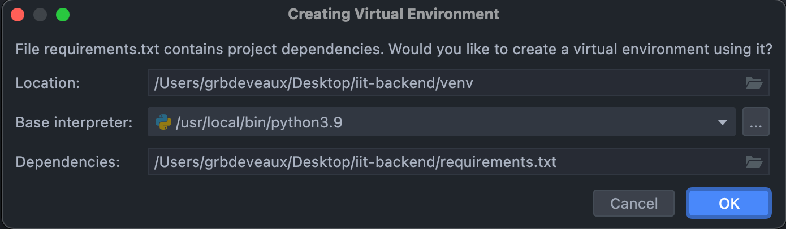

# iit-backend

Server side code for the International Immunity Tracker.

# Table of Contents

- [iit-backend](#iit-backend)
- [Table of Contents](#table-of-contents)
- [Set up](#set-up)
  - [Cloning](#cloning)
    - [WSL Recommendations](#wsl-recommendations)
  - [Environment Configuration](#environment-configuration)
    - [Using the Terminal](#using-the-terminal)
    - [Using PyCharm](#using-pycharm)
      - [PyCharm for macOS](#pycharm-for-macos)
        - [Installing Required Packages](#installing-required-packages)
        - [Run Configuration](#run-configuration)
      - [PyCharm on Windows](#pycharm-on-windows)
        - [Anaconda](#anaconda)
        - [Creating virtual environment](#creating-virtual-environment)
        - [Installing Required Packages](#installing-required-packages-1)
        - [Run Configuration](#run-configuration-1)
  - [Postgres](#postgres)
  - [Changing Alembic to use Flask SQLAlchemy](#changing-alembic-to-use-flask-sqlalchemy)
  - [Delete Previous Tables & Migrations](#delete-previous-tables--migrations)
  - [Upgrade to Using Newest Migrations](#upgrade-to-using-newest-migrations)
    - [Run migrations](#run-migrations)
    - [Populate local database](#populate-local-database)
  - [Running test suite](#running-test-suite)
  - [Loading Tableau CSV to Google Sheets](#loading-tableau-csv-to-google-sheets)
- [Helpful Code Snippets](#helpful-code-snippets)
  - [Working With Postgres](#working-with-postgres)
  - [Running ETL and Local Server](#running-etl-and-local-server)
  - [Export and Import](#export-and-import)
  - [Running Dockerized Flask App](#running-dockerized-flask-app)
- [Infrastructure Documentation (Current - Vanilla EC2)](#infrastructure-documentation-current---vanilla-ec2)
  - [CI/CD](#cicd)
    - [Continuous Integration](#continuous-integration)
    - [Continuous Deployment](#continuous-deployment)
    - [Results](#results)
  - [Cronjobs](#cronjobs)
  - [`tmux` sessions](#tmux-sessions)
- [Infrastructure Documentation (Future - Elastic Beanstalk)](#infrastructure-documentation-future---elastic-beanstalk)

# Set up

## Cloning

Using a terminal application, clone the repository using `git clone https://github.com/serotracker/iit-backend.git`.

### WSL Recommendations

If using Windows Subsystem for Linux (WSL) it is recommended that you clone `iit-backend` into your home directory *within* WSL. This will improve performance and Visual Studio Code compatibility. If you do this, you can still access your files using the Windows File Explorer. The following are the paths to your home directory in Windows and WSL. Here, Ubuntu is used for WSL:

- Windows: \\wsl.localhost\Ubuntu\home\<YOUR_USERNAME>
- WSL: /home/<YOUR_USERNAME>

Note that you can use `~/` as a shorthand for `/home/<YOUR_USERNAME>` e.g. `cd ~/` is equivalent to `cd /home/<YOUR_USERNAME>`.

If you plan on using Visual Studio Code as your editor, make sure to look at this [this guide](https://code.visualstudio.com/docs/remote/troubleshooting#_resolving-git-line-ending-issues-in-containers-resulting-in-many-modified-files) to avoid Git reporting a large number of modified files that have no actual differences. In short, by running `git config --global core.autocrlf input` in a WSL terminal, you can avoid a known issue where Visual Studio Code's version control tools show an excessive number of modified lines.

## Environment Configuration

### Using the Terminal

1. Setup `pip` package manager with `python -m ensurepip --upgrade`. For more details, see the official [pip documentation](https://pip.pypa.io/en/stable/installation/).
2. Install the `virtualenv` package with `pip install virtualenv`.
3. Inside the iit-backend directory, create a python virtualenv with `virtualenv .`
4. Run `touch .env` to create a `.env` file to store environment variables.
5. Use `nano .env` to format `.env` as follows (ask someone on the Data team for the actual environment variables you'll need):

```bash
PYTHONUNBUFFERED=1
FLASK_ENV=___
AIRTABLE_API_KEY=___
AIRTABLE_BASE_ID=___
GMAIL_PASS=___
DATABASE_USERNAME=___
DATABASE_PASSWORD=___
DATABASE_NAME=___
DATABASE_HOST_ADDRESS=___
MAPBOX_API_KEY=___
LOG_CONFIG_PATH=./logging.cfg
LOG_FILE_PATH=./logfile.log
SLACKBOT_TOKEN=___
ANALYZE_SPREADSHEET_ID=___
PYTHONPATH=$PYTHONPATH:$PWD:$PWD/app/
```

6. Activate the virtualenv
- Linux/WSL: `source bin/activate`
- macOS: `source venv/bin/activate`
- Windows: `Scripts\activate`

7. Load the environment variables using `set -o allexport; source .env; set +o allexport`
8. Install required dependents by running `pip install -r requirements.txt`. This step can take up to 20 minutes.
9. Run your script using `python path/to/your/script.py run`

### Using PyCharm

Install [PyCharm Community Edition](https://www.jetbrains.com/pycharm/download/).

#### PyCharm for macOS

In PyCharm, open iit-backend using `File > Open`.

When opening the project, PyCharm should detect the requirements.txt file and automatically prompt you to create a virtual environment for the project. The prompt should look like the picture below. Select your base interpreter and click `OK`. If this prompt doesn't appear, create a virtualenv interpreter manually [https://www.jetbrains.com/help/pycharm/project-interpreter.html#3b6542ac](https://www.jetbrains.com/help/pycharm/project-interpreter.html#3b6542ac)



##### Installing Required Packages

Using the steps above, PyCharm should automatically install all of the packages listed in `requirements.txt`. If you created your virtualenv manually or if PyCharm returns an error, try closing and reopening a `.py` file inside the project and click on the "install requirements" pop up. Alternatively, you can open the terminal in PyCharm and run `pip install -r requirements`.

If you encounter any errors installing packages, try installing them manually via the terminal with no version requirements.

##### Run Configuration

In the menu bar, select `Run > Edit Configuration`.

Click on the `+` symbol to add a new configuration and select Python. Configure as follows:

- Name: Give your configuration any name
- Script Path: select the script you want to run e.g. `manage.py` or `/app/github_public_repo/estimate_csv_creator.py`.
- Parameters: `run`
- Environment variables: Contact a team member for the complete list of environment variables
- Python interpreter: select the python virtual environment you configured above
- Interpreter options: leave blank
- Working directory: This should automatically fill based on the `Script path` value
- Add content roots to PYTHONPATH. Check this box
- Add source roots to PYTHONPATH. Check this box

Click OK.

You should now be ready to run your script!

#### PyCharm on Windows

Note that this method can work using either native Windows or WSL. However, if you are using PyCharm, it is strongly recommended that you clone the repository within your **Windows user profile** and **NOT your WSL user profile**. PyCharm WSL compatibility is only available with [PyCharm Pro Edition](https://www.jetbrains.com/help/pycharm/using-wsl-as-a-remote-interpreter.html) and the workarounds for the Community Edition are not documented here. 

##### Anaconda

Install Anaconda [https://docs.anaconda.com/anaconda/install/windows/](https://docs.anaconda.com/anaconda/install/windows/)

##### Creating virtual environment

In PyCharm, open iit-backend using `File > Open`. Click *Cancel* if prompted to create a virtual environment.

Create a virtualenv interpreter manually [https://www.jetbrains.com/help/pycharm/project-interpreter.html#3b6542ac](https://www.jetbrains.com/help/pycharm/project-interpreter.html#3b6542ac).

When adding your python interpreter, select *Conda environment* in the lefthand side. Make sure *New environment* is selected. Give *Location* a memorable name e.g. iit-backend. Click *OK* twice to return to the main PyCharm window.

##### Installing Required Packages

Click *install requirements* from the PyCharm prompt or run `conda install --file requirements.txt` in the terminal. This will install some of the packages using the `conda` package manager.

Many packages will fail to install using `conda`, this is expected behaviour. To install the rest of the packages, use `pip` instead of `conda`. To do this, run `pip install -r requirements.txt`.

It's likely that you'll run into issues installing the `Fiona` package. To install it, run `conda install fiona` in the terminal (package names are case-sensitive).

##### Run Configuration

In the menu bar, select `Run > Edit Configuration`.

Click on the `+` symbol to add a new configuration and select Python. Configure as follows:

- Name: Give your configuration any name
- Script Path: Select the script you want to run. This could be `manage.py` or `/app/github_public_repo/estimate_csv_creator.py` or others.
- Parameters: `run`
- Environment variables: Contact a team member for the complete list of environment variables
- Python interpreter: select the conda virtual environment you configured above
- Interpreter options: leave blank
- Working directory: This should automatically fill based on the `Script path` value
- Add content roots to PYTHONPATH. Check this box
- Add source roots to PYTHONPATH. Check this box

Click OK.

You should now be ready to run your script!

## Postgres

1. Download and install Postgres.

   From the source: [https://www.postgresql.org/download/](https://www.postgresql.org/download/)

   Or, on a Mac: `brew install postgresql`

2. Download and install pgAdmin 4, a management tool for Postgres.

   From the source: [https://www.pgadmin.org/download/](https://www.pgadmin.org/download/)

   Or, on a Mac: `brew install --cask pgadmin4`

After installation of pgAdmin 4, launch the program.

Verify that it was installed properly by navigating to the pgAdmin dashboard. You can do this by clicking "New pgAdmin 4 window...". (You should see the pgAdmin 4 elephant in your status bar if on Mac.) You should be brought to something like `http://127.0.0.1:63467/browser/` in your browser.

Once on the pgAdmin dashboard, create a new server named `serotracker` (right click on > Servers). Set the host name/address under the Connection tab to `localhost`.

Inside your new server, `serotracker`, create a new database named `whiteclaw`.

## Changing Alembic to use Flask SQLAlchemy

We are switching to use Flask migrations instead of just Alembic. Here is how to switch over:

## Delete Previous Tables & Migrations

1. Make sure you are on `architecture-v2` branch. We aren't merging to master yet due to
   rearchitecture.
2. Drop all the tables in the `public` schema in your local Postgres.

- You can do this manually by querying `DROP TABLE public.<table_name>` in Postgres for every table in the schema EXCEPT the
  `alembic_version` table (do not delete this!).

- You can leverage the application's shell, and the attached db to drop all associated tables.

      * Run ```python manage.py shell``` in your terminal. You will need all the environment variables that

  you currently use to run the app through `python manage.py run`, so just start the shell like you
  would start the app, but subsitute the `run` command for the `shell` command.

      * The application's shell should start (look's like a Python console)

      * Run ```from flask import current_app as app, db```

      * Run ```db.drop_all()```

      * Check your Postgres server to see that the only table left in the ```public``` schema is the

  `alembic_version` table.

FINALLY: 3. Delete the value of the `version_num` in the `alembic_version` table. Use
`DELETE FROM alembic_version`.

4. Delete your `alembic` folder where you previously stored all the migrations.

## Upgrade to Using Newest Migrations

1. Make sure you are on the latest version of the branch. You should see a folder called
   `migrations` at the top level (same level as `app`)

2. Move the `alembic.ini` file at the top level into your new `migrations` folder.

3. Add the following environment variables to the `.env` file at the top level:

- `DATABASE_USERNAME=your_database_username`
- `DATABASE_PASSWORD=your_database_password`
- `DATABASE_NAME=whiteclaw`

Finally, apply the migration to upgrade your `alembic_version` table to the latest version, and
recreate all the tables in the schema: `flask db upgrade`

### Run migrations

1. In the terminal, run `flask db upgrade`.

   This will run the migration with the most recent version code in `migrations/versions` and bring your database
   to the most up-to-date state with all the necessary tables.

2. Check that new tables have been created in the whitelcaw database running on your local Postgres server.

3. To revert a migration, run `flask db downgrade`

### Populate local database

Run the script `python app/database_etl/etl_main.py`.

Confirm that the data has indeed been migrated by checking pgAdmin 4.

## Running test suite

1. Create a config in which `FLASK_ENV=test`
2. Create an empty database called `whiteclaw_test`
3. Run `python manage.py test`

## Loading Tableau CSV to Google Sheets

1. Navigate to `https://console.cloud.google.com/apis/credentials/oauthclient/702218053502-fcrju4976lt0p1dntbln2qdolo72qjki.apps.googleusercontent.com?authuser=3&project=covid-corporate--1589232879130`.
2. Make sure you are signed into the console as `can.serosurveillance.dev@gmail.com`.
3. Click `DOWNLOAD JSON` and save the file as `credentials.json` in the `tableau_data_connector` directory.
4. Run `table_generator.py` for the first time. Authenticate using `can.serosurveillance.dev@gmail.com` the first time you run this.

# Helpful Code Snippets

## Working With Postgres

- Start Postgres database: `sudo service postgresql start`
- Open Postgres interactively: `psql -h localhost -d whiteclaw -U USERNAME -w`

## Running ETL and Local Server

- Export environment variables from `.env` file into current shell: `set -o allexport; source .env; set +o allexport`
- Add path to this Flask app to your `PYTHONPATH`: `export PYTHONPATH=PATH_TO_REPO/iit-backend:$PYTHONPATH`
- Run development server: `python3 -m flask run` (without environment variables exported) or `python3 manage.py run` (with or without environment variables exported)
- Run ETL: `python3 app/database_etl/etl_main.py` (with environment variables exported and Flask app in `PYTHONPATH`)

## Export and Import

- Export database snapshot: `pg_dump -h localhost -U USERNAME whiteclaw -f EXPORT-FILENAME.sql`
- Wipe the existing database:
  - Enter postgres interactively as the `postgres` user: `psql -U postgres -h localhost -W`
  - Drop the database: `drop database whiteclaw;`
  - Create the database: `create database whiteclaw;`
- Restore the snapshot: `psql -h localhost -U USERNAME whiteclaw < EXPORT-FILENAME.sql`

## Running Dockerized Flask App

- Prerequisite: Setup docker and docker desktop (optional). Use the following link if you have an M1 Mac (https://docs.docker.com/docker-for-mac/apple-silicon/)

- `cd` into the root of this repo
- Create a database dump and save it to `docker_postgres_dump.sql` using `pg_dump --create -h localhost -U <USERNAME> whiteclaw -f docker_postgres_dump.sql`
- Make sure you have the appropriate `.env` file at the root of this repo 
- Use the following command to set env vars based on your `.env`: `set -o allexport; source .env; set +o allexport`
- Run a cluster of containers using: `docker-compose up`. This will start a Flask app that's accessible via `localhost:5000` and a PostgreSQL instance that accessible to the Flask app.
- Shut down the cluster of containers using: `CTRL-C` followed by `docker-compose down`

---

# Infrastructure Documentation (Current - Vanilla EC2)

## CI/CD

### Continuous Integration

The following commands are run with CI:

```
pip install -r requirements.txt
python manage.py test
```

The full configuration is found [here](.github/workflows/ci.yml).

### Continuous Deployment

Deployment is conducted server-side. The documentation can be found [here](https://github.com/serotracker/scripts#update_backendsh).

### Results

Results of each job can be viewed in the Actions tab of the repository: https://github.com/serotracker/iit-backend/actions  
By default, upon a failed job, GitHub is configured to send emails to the author of the commit. To customize these notifications, refer to [GitHub Actions notification options](GitHub Actions notification options).

## Cronjobs

The backend makes use of `cron` to run jobs on a schedule.
The following tasks are executed by `cron`:

- Updating the backend
- Running the ETL
- Retrieving errors

To view/modify cronjobs run on a particular machine, run the command `crontab -e`.
This will open the `cron` file in a `vim` editor.  
In this file, each line contains one scheduled command. Refer to [this article](https://ostechnix.com/a-beginners-guide-to-cron-jobs/) to understand cronjob formatting.

For further information on `cron`, refer to the [crontab Linux manual](https://man7.org/linux/man-pages/man5/crontab.5.html).

## `tmux` sessions

A `tmux` session is an isolated environment on a machine where a process can run indefinitely. SeroTracker makes use of `tmux` sessions to run our backend servers and several scripts.  
The tmux sessions for each machine are summarized in the below table.

| Instance (IP address)  | Session name | Description                                |
| ---------------------- | ------------ | ------------------------------------------ |
| Prod (3.97.103.19)     | backend      | Run the Flask backend                      |
| Prod (3.97.103.19)     | install      | Install requirements, update the DB schema |
| Medium (35.182.41.225) | etl          | Run the ETL (once daily)                   |
| Dev (35.183.11.41)     | covidence    | Run the Covidence server                   |

# Infrastructure Documentation (Future - Elastic Beanstalk)

See https://docs.google.com/document/d/1sItF1-I8uhfz9kQX62x2RooS4BndqnDBXH9g9TAWss0/edit#
